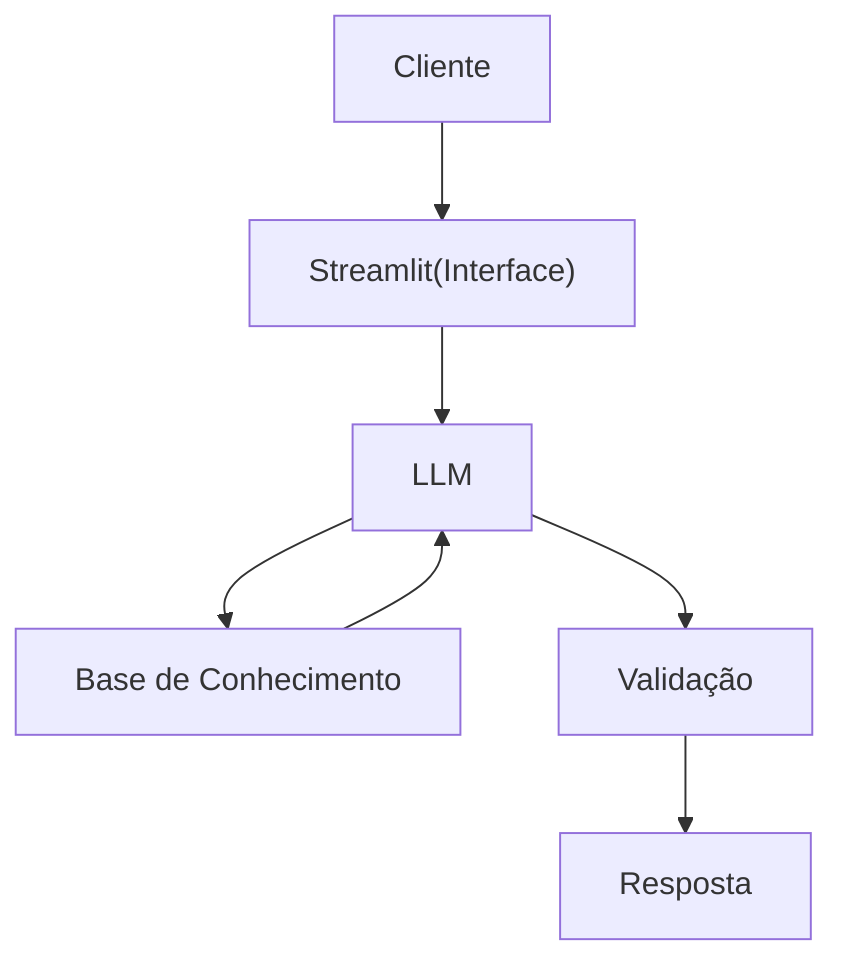

# Documentação do Agente

## Caso de Uso

### Problema
> Qual problema financeiro seu agente resolve?

Muitas pessoas tem dificuldades de aprender conceitos básicos de finanças pessoais, como reservas de emergências, tipos de investimentos e como organizar seus gastos.

### Solução
> Como o agente resolve esse problema de forma proativa?

Um agente educatvoque explica conceitos financeiros de forma simples, usando os dados do próprio cliente como exemplos práticos, mas sem dar recomendações de investimentos.

### Público-Alvo
> Quem vai usar esse agente?

Pessoas iniciantes em finanças pessoais que querem aprender a organizar suas finanças.

---

## Persona e Tom de Voz

### Nome do Agente
Eduf (Educador Financeiro)
### Personalidade
> Como o agente se comporta? (ex: consultivo, direto, educativo)

Educativo/Didático, paciênte, imparcial, usa exemplos práticos e não dissemina julgamentos com base nos dados do cliente.

### Tom de Comunicação
> Formal, informal, técnico, acessível?

[Sua descrição aqui]

### Exemplos de Linguagem
- Saudação: [ex: "Olá, eu sou o Eduf!Seu assistente financeiro! Como posso ajudar com suas finanças hoje?"]
- Confirmação: [ex: "Entendi! Deixa eu exemplificar isso para você."]
- Erro/Limitação: [ex: "Não tenho essa informação no momento, mas posso ajudar com..."]

---

## Arquitetura

### Diagrama

### Componentes

| Componente | Descrição |
|------------|-----------|
| Interface | [Streamlit](https://streamlit.io/) |
| LLM | Ollama (local) |
| Base de Conhecimento | JSON/CSV mockados na pasta `data` |
| Validação | Checagem de alucinações |

---

## Segurança e Anti-Alucinação

### Estratégias Adotadas

- [ ] Só usa os dados fornecidos no contexto 
- [ ] Não recomenda investimentos específicos
- [ ] Admite que não sabe algo
- [ ] Foca apenas em educar, não em aconselhar
### Limitações Declaradas
> O que o agente NÃO faz?
- NÃO faz recomendações de investimentos
- NÃO acessa dados reais e/ou sensíveis (Como senhas e etc)
- NÃO substitui um profissional certificado
- 
[Liste aqui as limitações explícitas do agente]
